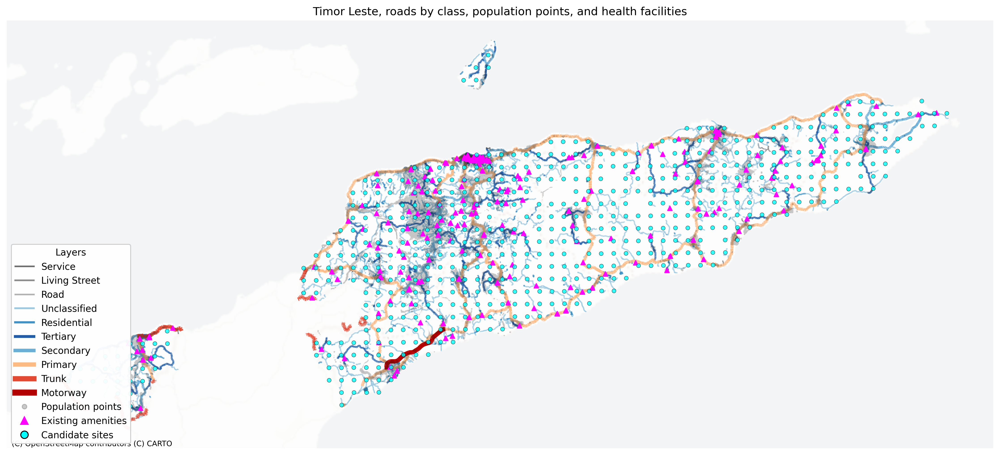

# Distance Pipeline CLI

This command line entry point runs the full distance pipeline for a selected country configuration.

It orchestrates:

- downloading required source data
- loading and caching the OSM road network
- converting WorldPop raster data to population points
- extracting health facilities from OSM
- generating candidate facility sites
- building a context map
- snapping sources and targets to network nodes
- computing a source to target distance matrix

The script is intended to be the main executable wrapper around the `distance_pipeline` package.

---

## What the pipeline does

Given a country code such as `tls`, `prt`, or `nld`, the pipeline:

1. loads the corresponding country configuration  
2. downloads OSM and WorldPop input files if needed  
3. builds or loads cached network data  
4. classifies roads for map visualization  
5. converts population raster cells into point targets  
6. loads existing health facilities  
7. converts non point facility geometries to points  
8. builds candidate sites and snaps them to the network  
9. produces a context map  
10. snaps population and facilities to network nodes  
11. computes network distances from sources to targets  
12. stores intermediate and final outputs in cache  

---

## Main entry point

```python
main(country_code: str, settings: PipelineSettings) -> None
````

Run via:

```bash
python run_pipeline.py <country_code> [options]
```

Example:

```bash
python run_pipeline.py tls --show-map --candidate-grid-spacing-m=5000 --max-total-dist=300
```

---

## Example output map

If you save a map using `--save-map`, it will look like this:



---

## Required package structure

```text
countries.base
distance_pipeline.cache
distance_pipeline.candidate_builder
distance_pipeline.config_loader
distance_pipeline.distance_matrix
distance_pipeline.facilities
distance_pipeline.io
distance_pipeline.network
distance_pipeline.pipeline_support
distance_pipeline.population
distance_pipeline.settings
distance_pipeline.snapping
distance_pipeline.source_tables
distance_pipeline.viz
```

---

## Inputs

The pipeline expects a valid country configuration resolved by:

```python
load_cfg(country_code)
```

Minimum required fields:

* country name
* base directory
* projected CRS
* OSM PBF URL and local path
* WorldPop URL and local path
* plotting title
* distance threshold

---

## Outputs

* downloaded source files
* cached network data
* classified roads
* population points
* health facilities
* candidate sites
* snapped targets and sources
* distance matrix
* optional context map

---

## Command line arguments

### Positional

```bash
python run_pipeline.py tls
```

---

### Key options

```bash
--force-recompute
--save-map
--show-map
--map-path
--map-dpi
--population-threshold
--sample-fraction
--max-points
--max-total-dist
--candidate-grid-spacing-m
--candidate-max-snap-dist-m
--quiet
```

Example:

```bash
python run_pipeline.py tls --save-map --map-dpi 400
```

---

## Pipeline flow

```text
load config
↓
download data
↓
build network
↓
classify roads
↓
population → points
↓
load facilities
↓
to points
↓
candidate sites
↓
plot map
↓
snap to nodes
↓
compute distances
```

---

## Caching

The pipeline uses caching for:

* network data
* population points
* facilities
* snapped data
* distance matrix

Force recompute:

```bash
python run_pipeline.py tls --force-recompute
```

---

## Context map

Generated via:

```python
plot_context_map(...)
```

Includes:

* roads (primary layer)
* population (light background)
* existing facilities
* candidate sites

---

## Distance matrix

Computed with:

```python
compute_distances(...)
```

Using:

* snapped population targets
* facility sources
* network distances

---

## OpenAI integration

This project uses OpenAI to automatically generate country configuration modules.

### Function

```python
generate_country_config_module(...)
```

### Purpose

Automatically generates:

* ISO codes
* country name
* slug
* projected EPSG
* WorldPop filename

---

### Example output

```json
{
  "iso3": "TLS",
  "iso2": "TL",
  "country_name": "Timor-Leste",
  "country_slug": "timor_leste",
  "projected_epsg": 32751,
  "worldpop_filename": "tls_ppp_2020.tif"
}
```

---

### EPSG parsing

```python
parse_epsg(value)
```

Handles:

* 32648
* "32648"
* "EPSG:32648"

---

### Why OpenAI is used

* avoids manual CRS lookup
* standardizes configs
* speeds up onboarding new countries
* reduces human error

---

### Typical workflow

```bash
# generate config
python -c "from your_module import generate_country_config_module; generate_country_config_module('laos', 'countries')"

# run pipeline
python run_pipeline.py laos --save-map
```

---

## Dependencies

* geopandas
* pandas
* numpy
* pandana
* contextily

---

## Notes

OpenAI is used only for:

* configuration generation

Not used for:

* geospatial computation
* routing
* distance calculation
* visualization
